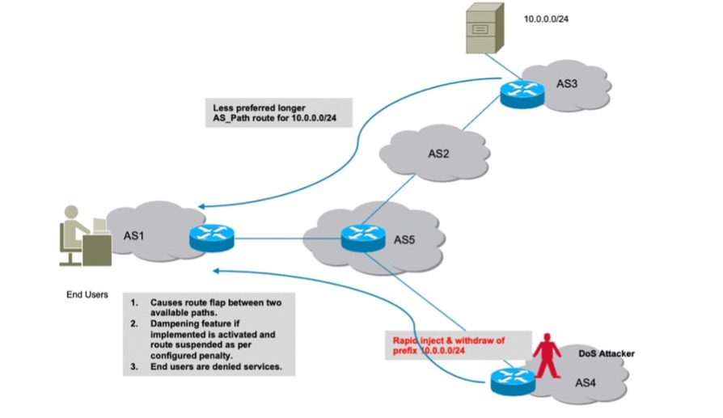

## BGP validate with Scrapli

The BGP Origin Autonomous System (AS) Validation feature provides a mechanism to prevent network administrators from mistakenly announcing routes to networks that they are not authorized to control.

In these lines of code, we performed BGP validation using the pydantix data model with Scrapli.

